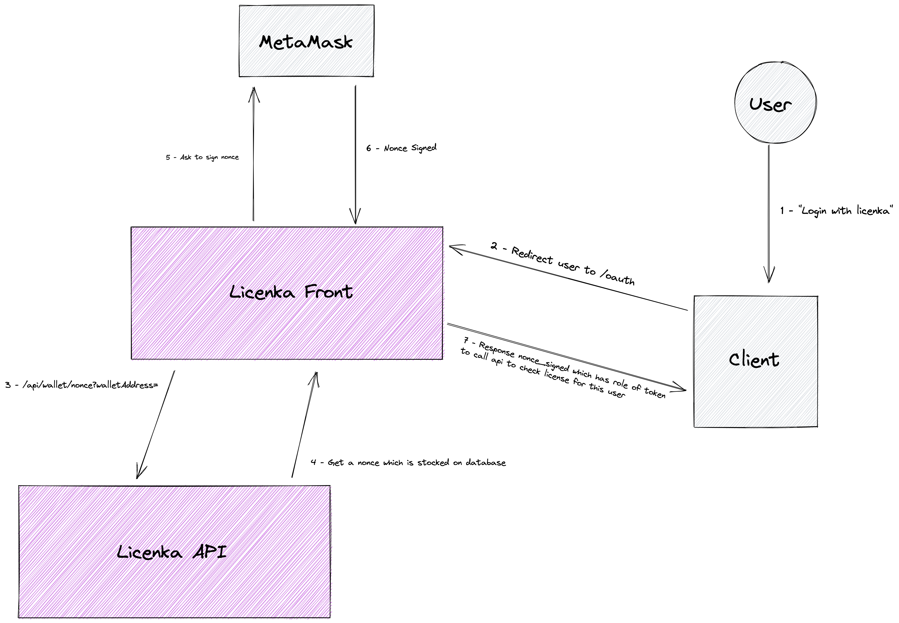

<p align="center">

</p>
<h3 align="center">Web3 license manager for the Starton Hackathon</h3>

## ⚙️ How to setup your project
⚠️ The contracts are currently deployed on the testnet, it is important to use it and not to use the mainnet.
### 🐳 With Docker (recommanded)
1. Add your [Starton API Key](https://app.starton.io/en/projects) `API_KEY` in the [.env](.env) file of the project
2. Setup MongoDB vars `MONGODB_URI` and `DB_NAME` in the [.env](.env) file of the project
3. Make sure Docker is working with `docker run hello-world`
4. Build and start the app with `docker compose up`
### 🫳🏼 By hand
It is recommanded to use [NVM](https://github.com/nvm-sh/nvm) to have the correct node version.
1. Export your Starton API Key with `export API_KEY=xx_xxx_xxxxxxx-xxxx-xxxx-xxxxxxxxxx`, replacing *xxxxx* with your key
2. Export your MongoDB vars with `export MONGODB_URI=xxx && export DB_NAME=xxx`, replacing *xxx* with your vars
3. Install the correct version of node with `nvm install 18`
4. Use the correct version of node with `nvm use`
5. Install dependencies with `npm install`
6. Build the app with `npm run build`
7. Start the app with `npm start`

You can now access to the app at [http://localhost:3000](http://localhost:3000) or [http://localhost:80](http://localhost:80)
#### See the deployed project on [licenka.space](https://licenka.space) !
## 💣 Problem
**It is difficult for small businesses to manage their license sale.**

After thinking about the tracks proposed in this hackathon, we have finally found this problem: "It's difficult for small businesses to manage their sold licenses" which is into the "E-Society" track.

Nowadays, many companies want to sell their software products through the sale of licenses to its users.  
However, in order to be able to sell licenses, these companies are forced to choose between two options: develop their own license and user management solution, or pay another company for a license management service.

In both cases, doing this is very expensive for businesses, which is very complicated for small businesses. This problem can also affect open-source projects, which do not have funds, and which must also find their own solution to make the companies that use the project pay, for example.
The other problem that can arise concerns users, indeed if the platform managing their license were to close, there is no longer any evidence that the user has paid the license.

In our opinion, this issue falls within the theme of "Building a decentralized Future" because the important themes of real possession of its information, infallibility and democratization of decentralized technologies are at the heart of the challenges of Web3.
## 💡 Our solution
To solve this issue, we decided to create a license management platform called **Licenka**.

The objective of our platform is to make it easy to create a license by defining a price in BUSD and linking a wallet that will receive the funds when purchasing the license.

One of the challenges is to allow companies to use our solution very easily, so we were inspired by Starton in order to offer public API routes allowing companies to very simply buy, and check if a user has a license without Web3 knowledge.

The technologies we used are [Next.js](https://nextjs.org/) for the front and the API, [Vercel](https://vercel.com/) for the deploy, [Docker](https://www.docker.com/), [MongoDB](https://www.mongodb.com/), [Web3.js](https://github.com/web3/web3.js), **Starton API**, **BNB Chain** and we support **Ledger**.

Our main technical challenge was to be able to buy licenses easily, because it is necessary to approve the transfer of funds beforehand to be able to make the payment, and companies should not need to use Web3 technologies. Thus, we decided to create a page inspired by Paypal, on which the payment is made and which redirects the user to the chosen address once the license has been acquired.
<p align="center">

<br>Created figma model
</p>

Another problem we had to deal with was the fact that we could easily authenticate a user with metamask, on a Web2 app, to verify that he had a license. However we have developed a "oauth" flow (describe below). After oauth flow the client will receive a signed_nonce, which is use to call our Web2 API to authenticate the user and permit to client to know if the user has the license. This process avoids to the Web2 version for companies that do not wish to use Metamask auth.

<p align="center">

<br>Oauth flow
</p>

Thus, our solution can work both with the implementation of their own authentication flow for Web3 client, and both with the Web2 version for companies that do not wish to use Metamask auth.

## 📄 Facility
#### See the deployed project on [licenka.space](https://licenka.space) !2
⚠️ The contracts are currently deployed on the testnet, it is important to use it and not to use the mainnet.
Here are the steps to install and test our project :
1. Use `git clone git@github.com:MaximePremont/Licenka.git`
2. Use `cd Licenka`
3. Add your [Starton API Key](https://app.starton.io/en/projects) `API_KEY` in the [.env](.env) file of the project
4. Setup MongoDB vars `MONGODB_URI` and `DB_NAME` in the [.env](.env) file of the project
5. Setup and start like described [here](#how-to-setup-your-project), recommanded : `docker compose up`

You can now access to the app at [http://localhost:3000](http://localhost:3000)
## 👋 Team and comments
#### Team name: POCKER
Team members :
- [Maxime PREMONT](https://github.com/MaximePremont)
- [Victor GUYOT](https://github.com/MrSIooth)
- [Nolann SABRE](https://github.com/Nolann71)
- [Mikael VALLENET](https://github.com/Mikatech)
- [Ahmed ABOUELLEIL-SAYED](https://github.com/AhmedFr)

During the hackathon we learned how to create a contract on the BSC blockchain and deploy it using Starton API/Front. Using next.js and Web3.js we were able to create our first Dapp, and interact with our contract using Starton and direct function calling with Web3.js.
## 📌 Technical documentation
To use our system, you must first create a license in order to obtain the license ID. Then it is possible to use it as desired.

🛟 **It is possible to define an expiration for licenses in days when they are created !**

⚠️ The contracts are currently deployed on the testnet, it is important to use it and not to use the mainnet.

🗒 Here are the following address:
- **Licenka Contract address:** 0x150B6328F1810589aF899f6d9F17E0347f77c8b8
- **BUSD Contract address** : 0xeD24FC36d5Ee211Ea25A80239Fb8C4Cfd80f12Ee

Our solution is deployed and working with 3 parts :  
1. A main page ([https://licenka.space](https://licenka.space)) to show the project
2. A license creation page ([https://licenka.space/create](https://licenka.space/create)), to create a new license with our wallet
3. A license buy page ([https://licenka.space/approve](https://licenka.space/approve)), which allow the user to buy a license with his wallet, and redirect to the company page after that.
4. A oauth page ([https://licenka.space/oauth?redirect_uri=https://demo.licenka.space/auth&licence_id=7](https://licenka.space/oauth?redirect_uri=https://demo.licenka.space/auth&licence_id=7))

⚠️ To work with the purchase page, the company must indicate the license to be purchased and the page to redirects to something like this : *https://licenka.space/approve/?license=XX&redirect=https://xxxxxx.xx*

As explained, our API can be used in 2 different ways: Web2 or Web3 :
- **`Web2 API`**:
    - Get license informations for a user `https://licenka.space/api/license`
        ```
        Query:
            userAddress
            licenseId
        200:
            license: {
            licenseId: 
            validTime: 
            isInfinite: 
        }
    - Know if a user has a license `https://www.licenka.space/api/checkLicense`
        ```
        Query:
            userAddress
            licenseId
            signedNonce
        200:
            license: bool
    - Get a nonce of user, with this nonce signed we can authenticate user `https://www.licenka.space/api/wallet/nonce`
        ```
        Query:
            walletAddress
        200:
            nonce: string
- **`Web3 Licenka`**: &nbsp;Here are the functions which can be called by users (Owner functions and internal functions are not displayed)
    - **Licenka Contract address:** 0x150B6328F1810589aF899f6d9F17E0347f77c8b8
    - **BUSD Contract address** : 0xeD24FC36d5Ee211Ea25A80239Fb8C4Cfd80f12Ee

    &nbsp;
    - Get the `license` information from a given ID.
    ```sol
        function licenses(uint index) returns(License)

        struct License {
            address owner;
            string name;
            uint price;
            uint duration;
        }
    ```

    - Get the `subscription` information from a given ID.
    ```sol
        function subscriptions(uint index) returns(Subscription)

        struct Subscription {
            address owner;
            uint validTime;
        }
    ```

    - Create a `license` with a given **name**, **price**, and **duration** (0 for an endless license). Each payment will be sent to the **owner** address.
    ```sol
        function createLicence(address owner, string memory name, uint price, uint duration)
    ```

    - Create a `subscription` to a `license`.
    ```sol
        function subscribe(uint licenseId)
    ```

    - Check if an address has a valid `subscription` to a `license`. 
    ```sol
        function verifySubscription(address owner, uint licenseId) returns(bool)
    ```

    - Get all the `licenses` owned by a wallet
    ```sol
        function getLicenses(address owner) returns(uint[])
    ```

    - Get all the `subscriptions` owned by a wallet
    ```sol
        function getSubscriptions(address owner) returns(uint[])
    ```

    - Get information about the `subscription` of the owner for a `license`.
    ```sol
        function getSubscriptionIdForLicense(address owner, uint licenseId) returns(uint)
    ```
- **`Web3 LicenkaChecker`**: &nbsp;LicenkaChecker is a contract to be added to developers' contract who would like to check for users subscription validity.
    - Add the address of the Licenka contract address.
    ```sol
        constructor(address licenkaAddress)
    ```

    - Modifier to require a wallet to have a valid `subscription` to a `license`.
    ```sol
        modifier mustBeSubscribe(address owner, uint licenseId)
    ```

## ☀️ Business model & Growth
The objective of our project is to propose a reliable and very inexpensive alternative. Thus, we will earn money by taking **3 %** when purchasing a license with our system.

Our possible project has a very big potential to grow, indeed we have already been able to imagine an even more advanced system which would make it possible to propose an client and/or an user dashboard to they can manage their purchased or selled licenses.
#### 🚀 After some improvements, our project will be ready to be deployed on the mainnet !

## 📤 Project Submission
#### 💾 Presentation video
<p align="center">
<a href="https://www.youtube.com/watch?v=ARY3FKYPMy8&ab_channel=MaximePremont"></a>
<a href="https://www.youtube.com/watch?v=ARY3FKYPMy8&ab_channel=MaximePremont">https://www.youtube.com/watch?v=ARY3FKYPMy8&ab_channel=MaximePremont</a>
</p>

## 🧪 Demonstration app
We have built an demonstration app, called CloudGaming, you've seen in the previous video. This application is in [demo](demo/) folder. If you want to know how to implement Licenka and/or test it, check the demo [demo/README.md](demo/README.md).

## ⭐️ Conclusions
### Our project is deployed and available on [licenka.space](licenka.space) !
### Features :
- Web3 implementation
- Web2 API simple implementation
- Create a license
- Create a license with expiration time
- Check if user has a license
- Get license informations for a user
- Buy a license
- Oauth flow with wallet signature of an nonce
- Be able to authenticate user with signed nonce

### Partners :
- Starton : for contract calls and management
- BNB Chain : deployment
- Ledger : full compatibility of ledger wallets with our system

❤️ Thanks to Starton and all of its partners for making it possible to attend the talks, workshops and the organization of this hackathon.
